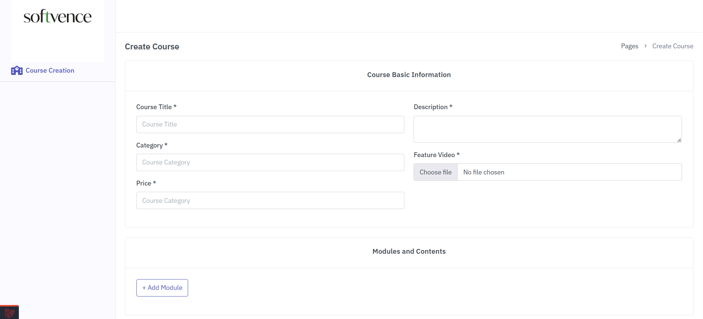
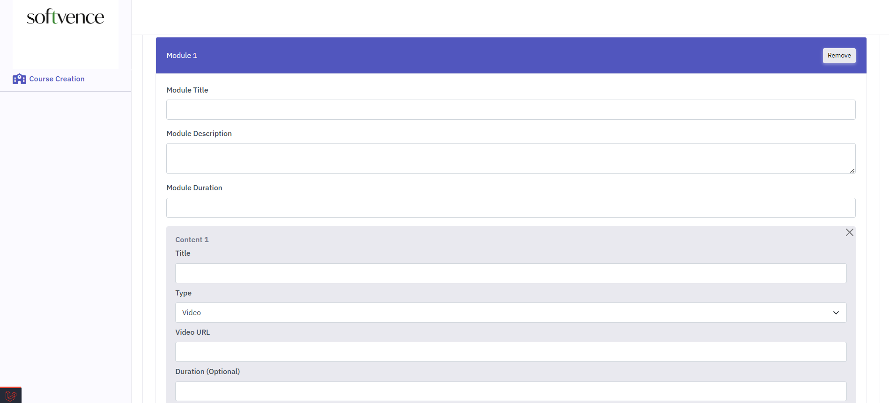

<!-- PROJECT LOGO -->
<br />
<div align="center">
  <a href="">
    
  </a>

[//]: # (<h2 align="center"> JobPulse: Job Portal Management System</h2>)

##  Course Creation Web Page

  <p align="center">Develop a course creation web page using HTML, CSS, Vanilla JavaScript, and jQuery for the frontend, and Laravel for the backend. The page should enable users to create courses with multiple modules, each containing multiple content items. </p>

</div>


## Built With
### Frontend

- [![JQuery][JQuery.com]][JQuery-url]
- [![Bootstrap][Bootstrap.com]][Bootstrap-url]

### Backend
- [![Laravel][Laravel.com]][Laravel-url]
- ![MySql][mysql.com]


<!-- GETTING STARTED -->

## Getting Started

### Prerequisites

* PHP 8.2+
* Laravel 12.x+
* Composer (dependency manager for PHP)
* Database (MySQL)
* Git

### Installation

Please Follow the steps to install this project Locally.

#### 1. Clone the repo

Open your terminal and navigate to the directory where you want to install the Laravel project.
Then run the following command:

   ```sh
   git clone https://github.com/Sabbir-Hossain12/course-creation-web-page
   ```

#### 2. Navigate to Project Directory

Move into the project directory:

   ```sh
   cd course-creation-web-page
   ```

#### 3. Install Dependencies

Once you are in the project directory, use Composer to install the required dependencies:

   ```sh
   composer install
   ```

#### 4. Create Environment File

Laravel requires an environment file for configuration. Duplicate the .env.example file and save it as .env:

   ```sh
   cp .env.example .env
   ```

#### 5. Generate Application Key

Run the following command to generate a unique application key:

   ```sh
php artisan key:generate
   ```

#### 6. Run Migrations

Use the following command to run database migrations:

   ```sh
  php artisan migrate
   ```   
#### 7. Run Database Seeding

To populate your database with initial or test data, use the following command:

   ```sh
 php artisan db:seed
   ```  

#### 8. Serve the Application

You can use Laravel's built-in development server to run the application locally.
Execute the following command:

```sh
php artisan serve
```   

This will start a development server, and you can access your Laravel application at http://127.0.0.1:8000 in your web
browser.
<hr>


<!-- ROADMAP -->

## Screenshots



<!-- CONTACT -->

## Contact

Sabbir Hossain- h.sabbir36@yahoo.com


[Laravel.com]: https://img.shields.io/badge/Laravel-FF2D20?style=for-the-badge&logo=laravel&logoColor=white

[Laravel-url]: https://laravel.com

[Bootstrap.com]: https://img.shields.io/badge/Bootstrap-563D7C?style=for-the-badge&logo=bootstrap&logoColor=white

[Bootstrap-url]: https://getbootstrap.com

[JQuery.com]: https://img.shields.io/badge/jQuery-0769AD?style=for-the-badge&logo=jquery&logoColor=white

[JQuery-url]: https://jquery.com
[mysql.com]: https://img.shields.io/badge/mysql-white?style=for-the-badge&logo=mysql&logoColor=black